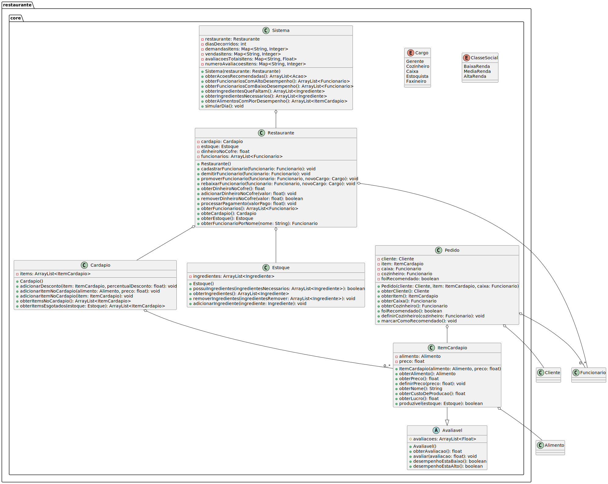
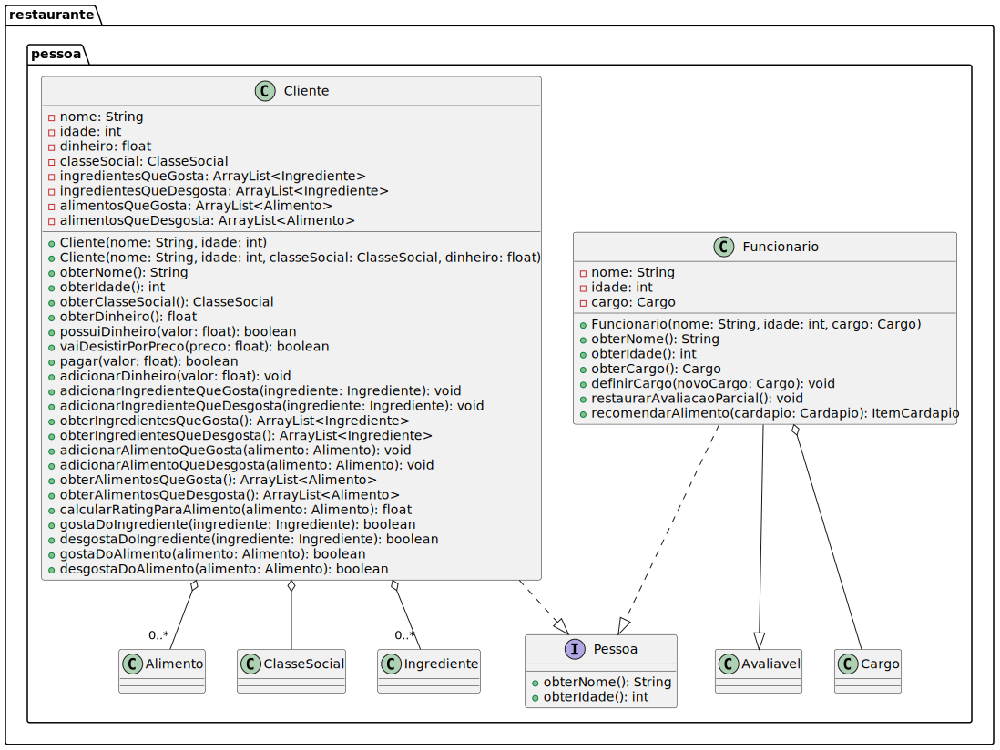

# Restaurante (Projeto de POO)

## Sobre o Projeto

Este projeto é uma simulação de um sistema de gestão para um restaurante, desenvolvido como um trabalho da disciplina de **Programação Orientada a Objetos (POO)**. O sistema modela operações diárias como gerenciamento de estoque, cardápio, funcionários, e processamento de pedidos. Ele também inclui uma lógica de "sistema de negócio" para analisar o desempenho e fornecer recomendações estratégicas.

[Licença MIT](./LICENSE.md)

## Como Executar

### Pré-requisitos

- **Java 21** ou superior
- **GNUMake** (Para Windows ou Linux)
- Sistema operacional Windows ou Linux

### Instalação de Dependências

#### Instalação do Java 21

**Windows**

- **Com `winget` (recomendado):** Abra o **PowerShell como Administrador** e execute:
```powershell
winget install Oracle.OpenJDK.21
```

- **Instalação manual (sem `winget`):** Baixe o instalador `.msi` para Windows na página de downloads oficial do OpenJDK 21 da Oracle e siga as instruções de instalação.

**Linux**

- **Em sistemas baseados em Debian/Ubuntu:**
```bash
sudo apt update
sudo apt install openjdk-21-jdk
```
- **Em sistemas baseados em Fedora/Red Hat:**
```bash
sudo dnf install java-21-openjdk-devel
```

#### Instalação do GNUMake

**Windows**

- **Com `winget`:** Abra o **PowerShell como Administrador** e execute:

```powershell
winget install GnuWin32.Make
```

- **Instalação manual:** A forma mais comum de obter o `make` no Windows é instalando o [MSYS2](https://www.msys2.org/). Após a instalação, use seu gerenciador de pacotes, o `pacman`, para instalar o `make`:

```bash
pacman -S make
```

**Linux**

- Na maioria das distribuições Linux, o GNUMake já vem pré-instalado. Para verificar, execute `make --version` no terminal.
- Se não estiver instalado, utilize seu gerenciador de pacotes:
  - **Em sistemas baseados em Debian/Ubuntu:**
  ```bash
  sudo apt update
  sudo apt install make
  ```
  - **Em sistemas baseados em Fedora/Red Hat:**
  ```bash
  sudo dnf install make
  ```

### Compilação e Execução

1.  **Clone o repositório**

```bash
git clone [url-do-repositorio]
cd restaurante-projeto
```

2.  **Compile o projeto**

```bash
make build
```

3.  **Execute o programa**

```bash
make run
```

---

## Diagramas de Classes UML

Os diagramas de classes abaixo ilustram a arquitetura completa do projeto e as relações entre suas classes.

### 1. Classes Principais do Restaurante

Este é o diagrama principal que mostra o núcleo do sistema: as classes **`Restaurante`**, **`Cardapio`**, **`Estoque`**, **`Pedido`** e **`Sistema`**. Ele também apresenta a interface **`Avaliavel`**, que é a base para a avaliação de desempenho de funcionários e itens.



**Análise do Diagrama:**

- **`Restaurante`** é o agregador central, com associações de composição (losango preenchido) para `Cardapio`, `Estoque` e `Funcionario`, indicando que esses objetos fazem parte integral do restaurante.
- **`Sistema`** usa (`--`) a classe `Restaurante` para coletar dados e realizar análises.
- **`ItemCardapio`** implementa (`--|>`) a interface `Avaliavel`, o que permite que ele seja avaliado por clientes.
- As classes `Cargo` e `ClasseSocial` são enums, que definem um conjunto fixo de valores e são usadas por outras classes para tipagem.

---

### 2. Classes de Pessoas e Funcionários

Este diagrama detalha a hierarquia das classes de pessoas no sistema.



**Análise do Diagrama:**

- A interface **`Pessoa`** define um contrato básico para qualquer pessoa no sistema, como obter nome e idade.
- As classes **`Cliente`** e **`Funcionario`** implementam (`..|>`) a interface `Pessoa`, garantindo que ambas tenham os métodos básicos definidos.
- A classe `Funcionario` também implementa a interface `Avaliavel`, permitindo que seu desempenho seja avaliado. Há uma associação entre `Funcionario` e o enum `Cargo`.

---

### 3. Classes de Alimentos e Ingredientes

Aqui estão as classes que definem o que é vendido e o que é usado para produção.


**Análise do Diagrama:**

- As classes **`Alimento`** e **`Ingrediente`** são abstratas, o que significa que não podem ser instanciadas diretamente. Elas servem como base para as subclasses concretas.
- Todas as subclasses de `Alimento` e `Ingrediente` herdam (`--|>`) seus respectivos comportamentos, como o cálculo de custo de produção e o nome do item.
- Uma associação entre `Alimento` e `Ingrediente` indica que um alimento é composto por um ou mais ingredientes.

---

### 4. Classes de Ações

Este diagrama mostra o sistema de ações gerenciais, que permite ao `Sistema` recomendar e ao usuário executar ações estratégicas.


**Análise do Diagrama:**

- A classe **`Acao`** é uma classe abstrata que define um contrato comum para todas as ações do sistema, como `executar()` e `obterNome()`.
- Todas as classes de ações específicas (`AplicarDesconto`, `DemitirFuncionario`, etc.) herdam (`--|>`) de `Acao`, garantindo que elas possam ser tratadas de forma polimórfica pelo sistema.
- A maioria das ações tem associações com outras classes do projeto (`Restaurante`, `Cardapio`, `Funcionario`, etc.), pois precisam manipular o estado desses objetos para serem executadas.


## Estrutura do Projeto

```
restaurante/
├── Main.java                          # Classe principal com interface do usuário
├── Restaurante.java                   # Classe principal do restaurante
├── Sistema.java                       # Sistema de simulação e recomendações
├── Cardapio.java                      # Gestão do cardápio
├── ItemCardapio.java                  # Item individual do cardápio
├── Estoque.java                       # Controle de estoque
├── Pedido.java                        # Representação de pedidos
├── Avaliavel.java                     # Classe abstrata para avaliações
├── Cargo.java                         # Enum dos cargos
├── ClasseSocial.java                  # Enum das classes sociais
├── pessoa/
│   ├── Pessoa.java                    # Interface para pessoas
│   ├── Cliente.java                   # Classe cliente
│   └── Funcionario.java               # Classe funcionário
├── alimento/
│   ├── Alimento.java                  # Classe abstrata de alimentos
│   ├── Hamburguer.java                # Hambúrguer básico
│   ├── CheeseBurguer.java             # Hambúrguer com queijo
│   ├── BaconBurguer.java              # Hambúrguer com bacon
│   ├── BigBurguer.java                # Hambúrguer duplo
│   ├── ChickenBurguer.java            # Hambúrguer de frango
│   ├── VeggieBurguer.java             # Hambúrguer vegetariano
│   ├── BatatasFritas.java             # Batatas fritas
│   ├── Refrigerante.java              # Refrigerante
│   ├── MilkShake.java                 # Milk shake
│   └── Suco.java                      # Suco natural
├── ingrediente/
│   ├── Ingrediente.java               # Classe abstrata de ingredientes
│   └── [25 tipos de ingredientes...]
├── acao/
│   ├── Acao.java                      # Classe abstrata de ações
│   ├── AplicarDesconto.java           # Aplicar desconto em item
│   ├── AumentarPreco.java             # Aumentar preço de item
│   ├── BaixarPreco.java               # Baixar preço de item
│   ├── DeclararFalencia.java          # Declarar falência
│   ├── DemitirFuncionario.java        # Demitir funcionário
│   ├── PromoverFuncionario.java       # Promover funcionário
│   ├── RebaixarFuncionario.java       # Rebaixar funcionário
│   └── ReporIngredienteNoEstoque.java # Repor ingredientes
└── erros/
└── FuncionarioNaoEncontradoErro.java  # Exception customizada
```

### Interface do Usuário

O sistema utiliza interface de linha de comando com navegação por teclas:

- **W/↑**: Navegar para cima
- **S/↓**: Navegar para baixo
- **Enter**: Selecionar opção
- **Q**: Sair/Voltar

## Fluxo de Execução

1.  **Inicialização**: Sistema cria restaurante com funcionários e cardápio inicial
2.  **Simulação 30 Dias**: Execução automática de 30 dias de operação
3.  **Dashboard do Franqueado**: Interface interativa para gestão pós-simulação

### Simulação Diária Inclui:

- Geração aleatória de clientes com diferentes perfis
- Processamento de pedidos e pagamentos
- Avaliação de funcionários baseada em desempenho
- Atualização de estoque e reposição automática
- Cálculo de receitas, custos e lucros
- Pagamento semanal de salários
- Sistema de recomendações gerenciais

## Arquitetura e Padrões

### Padrões de Design Utilizados

- **Strategy Pattern**: Diferentes tipos de alimentos e ingredientes
- **Command Pattern**: Sistema de ações gerenciais
- **Observer Pattern**: Sistema de avaliações
- **Factory Pattern**: Criação de clientes e funcionários

### Conceitos de POO Aplicados

- **Encapsulamento**: Atributos privados com métodos de acesso
- **Herança**: Hierarquia de classes para Alimento, Ingrediente, etc.
- **Polimorfismo**: Implementações específicas de métodos abstratos
- **Abstração**: Classes abstratas e interfaces para contratos

### Tratamento de Exceções

- Exception customizada para funcionários não encontrados
- Validações de negócio em operações financeiras
- Controle de fluxo para situações de estoque esgotado

## Funcionalidades Avançadas

### Sistema de IA Simulado

- **Análise de Padrões**: Identificação de tendências de demanda
- **Recomendações Inteligentes**: Sugestões baseadas em dados históricos
- **Otimização Automática**: Ajustes de preços baseados em performance

### Métricas e Analytics

- **Taxa de Conversão**: Percentual de clientes que fazem pedidos
- **Rentabilidade**: Cálculo de lucro por período
- **Performance de Funcionários**: Ranking baseado em avaliações
- **Análise de Cardápio**: Items mais e menos populares

### Gestão Financeira Avançada

- **Controle de Fluxo de Caixa**: Receitas vs. Despesas
- **Projeções**: Estimativas baseadas em histórico
- **Alertas**: Notificações de situações críticas
- **Relatórios**: Summários detalhados de performance

## Cenários de Teste

O sistema inclui diversos cenários para testar:

- **Crescimento Sustentável**: Bom gerenciamento leva ao sucesso
- **Crise Financeira**: Má gestão pode levar à falência
- **Rotatividade de Funcionários**: Impacto de contratações/demissões
- **Flutuações de Demanda**: Adaptação a mudanças no mercado

## Extensibilidade

O sistema foi projetado para fácil extensão:

- **Novos Alimentos**: Basta estender a classe `Alimento`
- **Novos Ingredientes**: Implementar a classe abstrata `Ingrediente`
- **Novas Ações**: Estender a classe `Acao` para funcionalidades gerenciais
- **Novos Cargos**: Adicionar ao enum `Cargo` e implementar lógica
- **Novos Relatórios**: Expandir o sistema de dashboard

## Documentação Técnica

### Dependências

- Java Standard Library (Collections, Scanner, Random)
- Nenhuma dependência externa necessária

## Licença

Este projeto foi desenvolvido para fins educacionais como parte da disciplina de Programação Orientada a Objetos.

---

2025 - Inaldo Neto, Lucas Soares e Marcel Guinhos - UNICAP